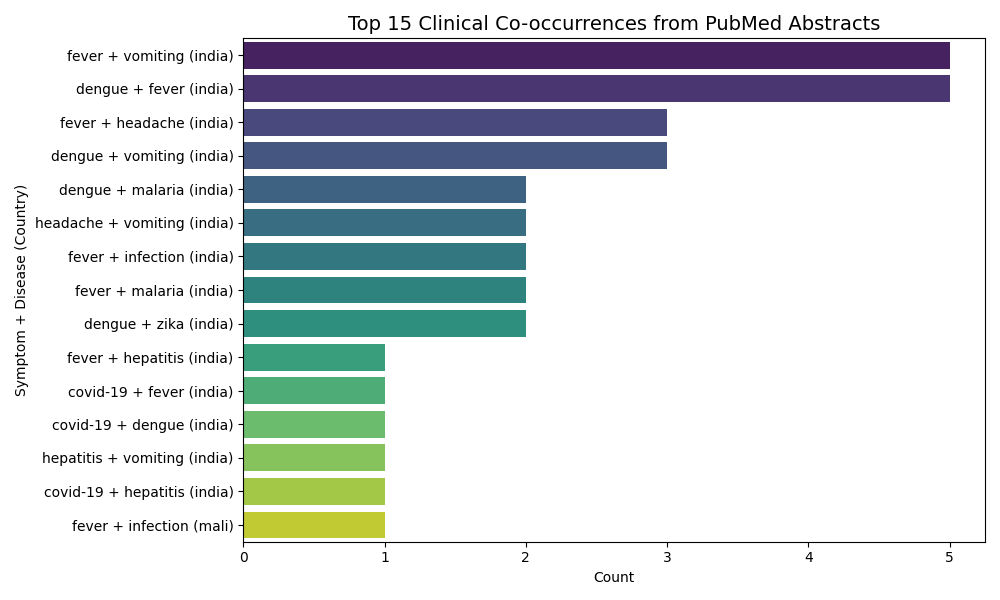
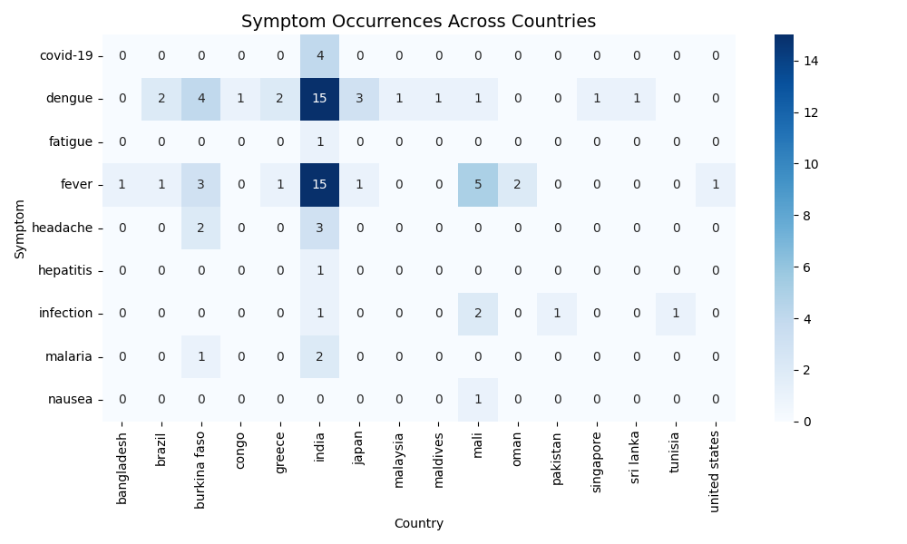

# 🧬 NLP PubMed Abstract Miner for Emerging Clinical Threats

This project mines PubMed abstracts to identify **co-occurring clinical symptoms, diseases, and geographic regions**, enabling early detection of **emerging health threats** like malaria, dengue, or COVID-19 across countries such as India, Ethiopia, and Kenya.

🔍 Built with:
- **NLP**: spaCy (`en_core_sci_md`)
- **Data Source**: PubMed (via `Biopython`)
- **Dashboard**: Streamlit
- **Visualization**: Seaborn & Matplotlib
- **Transformer-ready**: Built to scale with ClinicalBERT/Transformer integration

---

## 🚀 Features

- 🔎 **Live PubMed Search** or CSV Upload  
- 🧠 **Entity Extraction**: Detects symptoms, diseases, and countries  
- 🧼 **Rule-based Filtering** with a clinical whitelist  
- 📊 **Visualizations**:
  - Top Clinical Triplets Barplot  
  - Symptom–Country Heatmap  
  - Threat Index Calculation  
  - 📈 Time Trend Analysis of Mentions  
- 📥 **Downloadable Outputs** as CSV  
- 🧠 *(Coming Soon)* ClinicalBERT and Transformer Model Analysis  

---

## 📸 Sample Visuals

### 🔬 Top Clinical Co-occurrence Triplets


### 🌍 Symptom-Country Heatmap


### ⏳ Time Trend Plot


---

## 📁 Project Structure

```
Pubmed-NLP/
│
├── data/                    # Input/output datasets
│   ├── pubmed_fever_india.csv
│   ├── abstracts_with_entities.csv
│   ├── cooccurrence_matrix_filtered.csv
│   └── cooccurrence_matrix_with_threat_index.csv
│
├── output/                  # Plots for bar, heatmap, trends
│   └── *.png
│
├── notebooks/               # Modular Jupyter notebooks
│   ├── 01_Data_Collection.ipynb
│   ├── 02_Entity_Extraction.ipynb
│   ├── 03_Pattern_Recognition.ipynb
│   └── 04_Visualizations_and_Threat_Index.ipynb
│
├── app.py                   # Streamlit app
├── requirements.txt
└── README.md
```

---

## 💻 How to Run

### 1. Clone the repo
```bash
git clone https://github.com/deepikapratapa/Pubmed-NLP.git
cd Pubmed-NLP
```

### 2. Create environment and install dependencies
```bash
python -m venv .venv
source .venv/bin/activate
pip install -r requirements.txt
```

You may also need to download the spaCy model:
```bash
python -m spacy download en_core_sci_md
```

### 3. Run the Streamlit app
```bash
streamlit run app.py
```

---

## 🔍 Example Queries

```
"fever AND India"
"malaria AND Africa"
"covid-19 AND Kenya"
"dengue AND Southeast Asia"
```

---

## 📈 Threat Index

We compute a Threat Index as:

```math
ThreatIndex = Co-occurrence Count / Max Count
```

This gives a normalized metric (0–1) of how strongly a (symptom, disease, country) combination appears in the recent literature — a proxy for emerging patterns.

---

## 🧠 Future Work

✅ Add transformer models like ClinicalBERT, PubMedBERT  
✅ Keyword trendlines (monthly heatmaps)  
🧪 NER evaluation metrics  
🌐 Streamlit Cloud or Hugging Face deployment  
📰 Research paper or whitepaper submission  

---

## 🧑‍💻 Author

**Deepika Sarala Pratapa**  
🧪 MS Applied Data Science @ UF
